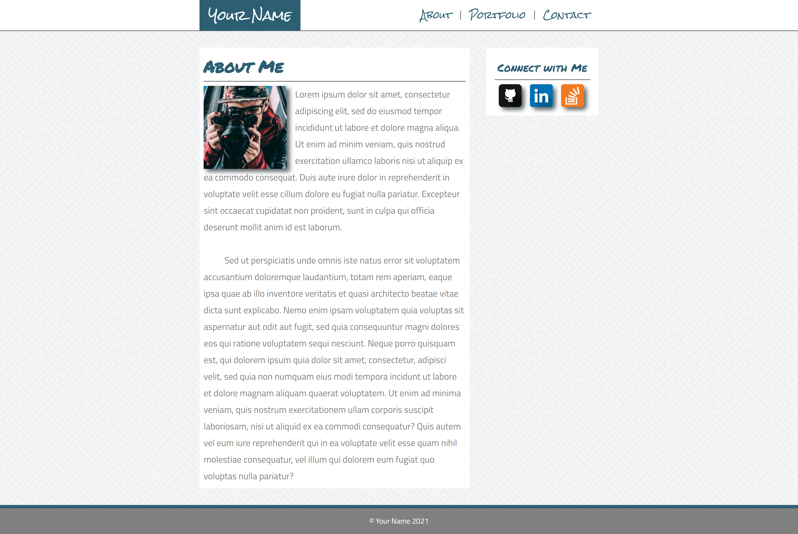

# Assignment 4: Re-Create a Portfolio Website using CSS Flexbox

(**NOTE:** View a rendered version of this file in VS Code with `ctrl-shift-v` or `cmd-shift-v`)

&nbsp;

&nbsp;
## Background

In this assignment you will update or re-create the portfolio assignment from the previous module using CSS Flexbox. This assignment is designed to familiarize you with creating layouts using CSS flexbox, as well as creating a fully-styled website.

&nbsp;
## Setup

1. Create a git repository titled `m4-hw4-lastname-firstname` and clone the repo to your computer. 
1. You may copy your `index.html` and `style.css` files from the previous assignment into the repository folder or create new ones for this assignment.

&nbsp;
## Instructions

1. For this assignment, you will update your site to use CSS Flexbox to layout the elements on the page. This applies whether you choose to write new code or to update the code from the previous assignment. **Do not use CSS floats except to wrap text around an image**.
1. You should use, at minimum, 3 flex containers on the page.
1. When finished, the site should still match [the included mockup image](mockup-1920.png) of a portfolio site. Although the mockup looks like it has three total pages, you are only responsible for creating the home/about me page as depicted in the mockup. As in the previous assignment, it's OK if your designs differ from the mockup as long as the page contains the same content and structure. The finished site must include:
    1. A header with your name and navigation links for "about", "portfolio", and "contact".
    1. A main content section with "about me" text that wraps around a profile image.
        * If you do not wish to use an image of yourself, [you may use a placeholder](https://pravatar.cc/).
        * You may use [lorem text](https://uhded.com/automatic-generate-lorem-vscode) for the site's copy if you wish instead of writing your own biographical info.
    1. A background pattern image applied behind the main content.
        * See [Subtle Patterns](https://www.toptal.com/designers/subtlepatterns/) or [Hero Patterns](https://www.heropatterns.com/) for free patterns.
    1. A sidebar to the right of the main text that includes social media icon links for [Stack Overflow](assets/soverflow.png), [LinkedIn](assets/linkedin.png), and [GitHub](assets/git.png)
    1. A footer at the bottom of the page that includes your name.
1. Your markup must use proper semantic tags.
1. Your site must be deployed to GitHub pages.

&nbsp;
## Deployment

Your code must be deployed to GitHub Pages. To deploy a repository to GitHub pages you must:

1. Ensure your repository has an `index.html` file in the root directory.
1. Navigate to the `settings` section of the repository.
1. Click on `pages` in the left navigation menu.
1. Under `source` click the dropdown and select your `master` or `main` branch.
1. Click `save`.

Your site should be deployed to `<your github username>.github.io/<your repository name>` in 5-10 minutes.

&nbsp;
## Submission

Please submit both a link to your repository and a link to the live site. Also please include any comments on stumbling blocks or difficulties encountered while completing the assignment.

Website: https://fell67.github.io/m4-hw4-abreu-victoria/